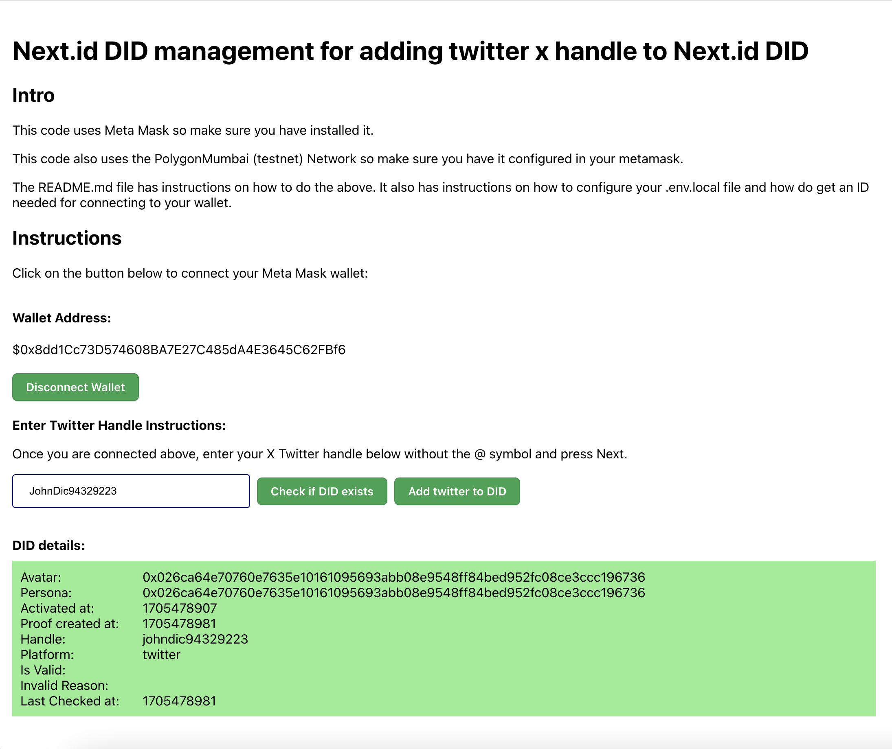
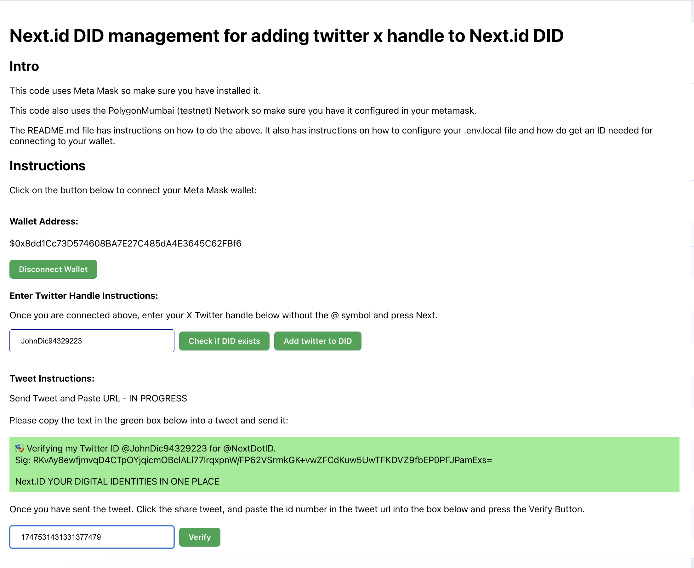

# README

**NOTE:**  Update 29/01/2024 This code is not complete .I am still working on it

## What is this project about?

Next.id has API which allow you to associate social medial handles with a Decentralised ID (DID).

This is example code showing how to associate a twitter X social media handle with a next.id DID.

Note next.id calls your DID an avatar.

This example uses Meta Mask wallet to do the required signing so that the user does not need to 
manage their own private key.

The public key is recovered from meta mask using the viem library.

The viem library also signs the verify payload response to produce the data required to build the
twitter tweet.  Once the tweet has been sent manually by the user, they click share and get the
tweet number from the URL.  They paste that number in a box so that the tweet can be verified.

So the user steps are:

(i) Paste twitter X handle into the box without the @ symbol

(ii) Press Next

(iv) Meta Mask will pop up a couple of times asking to sign stuff

(v) The text to paste into a tweet will be shown.

(vi) Paste the twitter text into a tweet and send it.

(vii) Click Share for the tweet and take the ID from the URL and paste it in the box.  Then press
      verify.

  If all is well you will be shown a message that the x handle was added to your DID.

  Else you will be shown an error message.

## Screen shots

  




## Instructions

### Copy env.local.sample

Copy env.local.sample to env.local

Go to:  

  https://cloud.walletconnect.com/sign-in

Get your project id and set it in the REACT_APP_WALLET_CONNECT_PROJECT_ID

So YOUR env.local will look something like:

    REACT_APP_ENVIRONMENT=local.env
    REACT_APP_WALLET_CONNECT_PROJECT_ID=ed0555b91e26b121d6a6145437c7b857
    REACT_APP_PROOF_SERVICE_BASE_URL=https://proof-service.nextnext.id

### Install Meta Mask

Install Meta Mask in your browser:

  https://metamask.io/download/

### Add polygonMumbai to Meta Mask

If you do not already have polygonMumbai configured in your MetaMask

In meta mask:

  click 3 dots
  Go to Settings
  Go to Networks
  Click Add Network

Configure as follows:
 
    Network Name:        Polygon Mumbai Testnet
    New RPC Url:         https://rpc.ankr.com/polygon_mumbai
    Chain ID:            80001
    Currency Symbol:     MATIC
    Block explorer URL:  https://mumbai.polygonscan.com/

### Build and Run

npm install

npm run start

Open in browser:

  http://localhost:3000/


### Browser instructions

(i) Paste twitter X handle into the box without the @ symbol

(ii) Press Next

(iv) Meta Mask will pop up a couple of times asking to sign stuff

(v) The text to paste into a tweet will be shown.

(vi) Paste the twitter text into a tweet and send it.

(vii) Click Share for the tweet and take the ID from the URL and paste it in the box.  Then press
      verify.

  If all is well you will be shown a message that the x handle was added to your DID.

  Else you will be shown an error message.

## Example Payloads

### Getting Payload

This is about getting the data we need to build a tweet:

POST: https://proof-service.nextnext.id/v1/proof/payload 

Payload: 

```
{
    "action": "create",
    "platform": "twitter",
    "identity": "JohnDic94329223",
    "public_key": "0x046ca64e70760e7635e10161095693abb08e9548ff84bed952fc08ce3ccc196736383d1673f699625e78080b9072d433bbac69e8f81d3430d9746615b69d9e9924"
}
```

Response:

```
{
    "post_content": {
        "default": "🎭 Verify @JohnDic94329223 with @NextDotID.\nSig: %SIG_BASE64%\nMisc: 6f1fa69c-13f8-4bec-acf6-c24003633df8|1705413052|",
        "en_US": "🎭 Verify @JohnDic94329223 with @NextDotID.\nSig: %SIG_BASE64%\nMisc: 6f1fa69c-13f8-4bec-acf6-c24003633df8|1705413052|",
        "zh_CN": "🎭 由 @NextDotID 验证 @JohnDic94329223 。\nSig: %SIG_BASE64%\n其它信息: 6f1fa69c-13f8-4bec-acf6-c24003633df8|1705413052|"
    },
    "sign_payload": "{\"action\":\"create\",\"created_at\":\"1705413052\",\"identity\":\"johndic94329223\",\"platform\":\"twitter\",\"prev\":null,\"uuid\":\"6f1fa69c-13f8-4bec-acf6-c24003633df8\"}",
    "uuid": "6f1fa69c-13f8-4bec-acf6-c24003633df8",
    "created_at": "1705413052"
}
```
&nbsp;

### Getting Proof

This is about verifying the posting of tweet. Note the proof_location is the ID in the tweet url
of your tweet.

POST: https://proof-service.nextnext.id/v1/proof

Payload:

```
{
    "action": "create",
    "platform": "twitter",
    "identity": "JohnDic94329223",
    "public_key": "0x046ca64e70760e7635e10161095693abb08e9548ff84bed952fc08ce3ccc196736383d1673f699625e78080b9072d433bbac69e8f81d3430d9746615b69d9e9924",
    "proof_location": "1747255272501018668",
    "extra": {},
    "uuid": "6f1fa69c-13f8-4bec-acf6-c24003633df8",
    "created_at": "1705413052"
}
```

Status of Response: 201 created

Response:
```
{}
```

Note:

* The created_at came from the response of the previous post to: https://proof-service.nextnext.id/v1/proof/payload 


## How to contact the owner of this repository

### By email

You can contact JD by email:

  zzzzjohn.charles.dickerson@gmail.com

(Remove zzzz from email)

### Via Github discussion

  https://github.com/spotadev/next-id-wallet/discussions


### Via Issue on Github

JD's github handle is: 

javaspeak


## Do you want to get involved?

JD is busy integrating next.id DID technology with UTU Trust.

JD is building a next.id DID management standalone react app which allows end users to manage their next.id DIDs.

That project is here:

https://github.com/spotadev/utu-endorse-nextid

---

JD is also building DID and Utu Trust into a social media platform which explores:

* filtering comments by next.id and trust
* user based self censorship

The social media platform has 2 variants:

* chrome extension
* one page app

---

You can also get involved with UTU Trust.  UTU Trust has bounty programmes for involving the community.

---

If you are interested in any of the above please contact me.

Thank you

JD